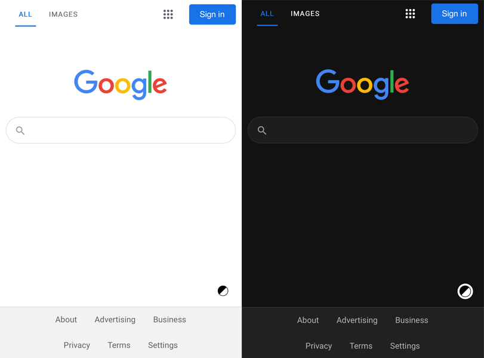

# The Odin Project: Google Homepage
The Odin Project Course Assignment

- This project is a part of [The Odin Project](https://www.theodinproject.com/paths/foundations/courses/foundations) Foundations curriculum

- The goal is to deconstruct and build a Google homepage using HTML, CSS and JavaScript

### Live preview: [link](https://davidtrikic.github.io/google-homepage/)

## Screenshots

### Desktop

### Mobile

